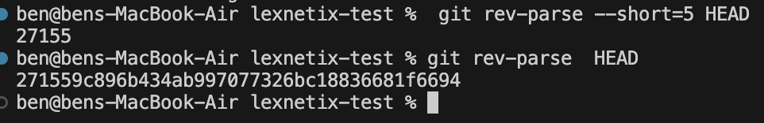

## 👀CI pipeline with Jenkinfile
### For macos arm64, I'll manage jenkins on my pulled jenkins docker container
#### follow the document create brigdge for docker cli
https://www.jenkins.io/doc/book/installing/docker/

```
docker run \
  --name jenkins-docker \
  --rm \
  --detach \
  --privileged \
  --network jenkins \
  --network-alias docker \
  --env DOCKER_TLS_CERTDIR=/certs \
  --volume jenkins-docker-certs:/certs/client \
  --volume jenkins-data:/var/jenkins_home \
  --publish 2376:2376 \
  docker:dind \
  --storage-driver overlay2
```
```
  docker build -t myjenkins-blueocean:2.462.2-1 .
```
```
  docker run \
  --name jenkins-blueocean \
  --restart=on-failure \
  --detach \
  --network jenkins \
  --env DOCKER_HOST=tcp://docker:2376 \
  --env DOCKER_CERT_PATH=/certs/client \
  --env DOCKER_TLS_VERIFY=1 \
  --publish 8080:8080 \
  --publish 50000:50000 \
  --volume jenkins-data:/var/jenkins_home \
  --volume jenkins-docker-certs:/certs/client:ro \
  myjenkins-blueocean:2.462.2-1
```
```
http://localhost:8080
docker exec -it <blueocean-container-id> /bin/sh

cat /var/jenkins_home/secrets/initialAdminPassword

```


### Using 'shell script' over Jenkinsfile retrive and parse

{height=100px}


### pipeline RESULT 🤩
```
Started by user ben

[Pipeline] Start of Pipeline
[Pipeline] node
Running on Jenkins
 in /var/jenkins_home/workspace/bruhbruhbruhbro
[Pipeline] {
[Pipeline] withEnv
[Pipeline] {
[Pipeline] stage
[Pipeline] { (Checkout)
[Pipeline] script
[Pipeline] {
[Pipeline] git
The recommended git tool is: NONE
No credentials specified
Cloning the remote Git repository
Cloning repository https://github.com/akp-beni-github/lexnetix_test_1.git
 > git init /var/jenkins_home/workspace/bruhbruhbruhbro # timeout=10
Fetching upstream changes from https://github.com/akp-beni-github/lexnetix_test_1.git
 > git --version # timeout=10
 > git --version # 'git version 2.39.2'
 > git fetch --tags --force --progress -- https://github.com/akp-beni-github/lexnetix_test_1.git +refs/heads/*:refs/remotes/origin/* # timeout=10
 > git config remote.origin.url https://github.com/akp-beni-github/lexnetix_test_1.git # timeout=10
 > git config --add remote.origin.fetch +refs/heads/*:refs/remotes/origin/* # timeout=10
Avoid second fetch
 > git rev-parse refs/remotes/origin/main^{commit} # timeout=10
Checking out Revision 271559c896b434ab997077326bc18836681f6694 (refs/remotes/origin/main)
 > git config core.sparsecheckout # timeout=10
 > git checkout -f 271559c896b434ab997077326bc18836681f6694 # timeout=10
 > git branch -a -v --no-abbrev # timeout=10
 > git checkout -b main 271559c896b434ab997077326bc18836681f6694 # timeout=10
Commit message: "Add minikube/ (Step3)"
First time build. Skipping changelog.
[Pipeline] }
[Pipeline] // script
[Pipeline] }
[Pipeline] // stage
[Pipeline] stage
[Pipeline] { (Get Commit ID)
[Pipeline] script
[Pipeline] {
[Pipeline] sh
+ git rev-parse --short=5 HEAD
[Pipeline] }
[Pipeline] // script
[Pipeline] }
[Pipeline] // stage
[Pipeline] stage
[Pipeline] { (Build Docker Image)
[Pipeline] script
[Pipeline] {
[Pipeline] dir
Running in /var/jenkins_home/workspace/bruhbruhbruhbro/node
[Pipeline] {
[Pipeline] sh
+ docker --version
Docker version 27.2.0, build 3ab4256
[Pipeline] sh
+ docker build -t my_image:27155 .
#0 building with "default" instance using docker driver

#1 [internal] load build definition from Dockerfile
#1 transferring dockerfile: 410B done
#1 DONE 0.0s

#2 [internal] load metadata for docker.io/library/node:alpine
#2 DONE 3.4s

#3 [internal] load .dockerignore
#3 transferring context: 2B done
#3 DONE 0.0s

#4 [internal] load build context
#4 transferring context: 76.73kB done
#4 DONE 0.0s

#5 [1/5] FROM docker.io/library/node:alpine@sha256:008735b83ef98c7635b5b73cb9b597172fe1895619a8d65378fa7110e427abb5
#5 resolve docker.io/library/node:alpine@sha256:008735b83ef98c7635b5b73cb9b597172fe1895619a8d65378fa7110e427abb5 0.0s done
#5 sha256:3f776ed3998db7e9f6348323386ee1682bcf44ea9a0a3cc031fcfc7a1b87cafe 6.38kB / 6.38kB done
#5 sha256:690e87867337b8441990047e169b892933e9006bdbcbed52ab7a356945477a4d 0B / 4.09MB 0.1s
#5 sha256:1276ff6b2e99fa1c9b84b8ef3b3e1d747a249ef136b65dad2f555990391238f7 0B / 48.18MB 0.1s
#5 sha256:c5b15c12d2bba9a505215ab67c33f3dd7c832a2e510a51b2ec3cb31df6919b96 0B / 1.39MB 0.1s
#5 sha256:008735b83ef98c7635b5b73cb9b597172fe1895619a8d65378fa7110e427abb5 6.41kB / 6.41kB done
#5 sha256:90ddeda73d03d40cda0cb2bf02178ad607e2528289fe795b005c738a18e9d248 1.72kB / 1.72kB done
#5 sha256:690e87867337b8441990047e169b892933e9006bdbcbed52ab7a356945477a4d 4.09MB / 4.09MB 0.4s done
#5 extracting sha256:690e87867337b8441990047e169b892933e9006bdbcbed52ab7a356945477a4d 0.1s done
#5 sha256:d78b09e12f646ed2447cbc843c9fd777490e3a0960a2ea8941c1e0696aab0289 0B / 447B 0.4s
#5 sha256:d78b09e12f646ed2447cbc843c9fd777490e3a0960a2ea8941c1e0696aab0289 447B / 447B 0.9s done
#5 sha256:1276ff6b2e99fa1c9b84b8ef3b3e1d747a249ef136b65dad2f555990391238f7 3.15MB / 48.18MB 2.0s
#5 sha256:1276ff6b2e99fa1c9b84b8ef3b3e1d747a249ef136b65dad2f555990391238f7 6.29MB / 48.18MB 2.2s
#5 sha256:1276ff6b2e99fa1c9b84b8ef3b3e1d747a249ef136b65dad2f555990391238f7 9.44MB / 48.18MB 2.4s
#5 sha256:1276ff6b2e99fa1c9b84b8ef3b3e1d747a249ef136b65dad2f555990391238f7 12.58MB / 48.18MB 2.5s
#5 sha256:1276ff6b2e99fa1c9b84b8ef3b3e1d747a249ef136b65dad2f555990391238f7 17.83MB / 48.18MB 2.7s
#5 sha256:1276ff6b2e99fa1c9b84b8ef3b3e1d747a249ef136b65dad2f555990391238f7 29.36MB / 48.18MB 2.9s
#5 sha256:1276ff6b2e99fa1c9b84b8ef3b3e1d747a249ef136b65dad2f555990391238f7 42.99MB / 48.18MB 3.1s
#5 sha256:1276ff6b2e99fa1c9b84b8ef3b3e1d747a249ef136b65dad2f555990391238f7 48.18MB / 48.18MB 3.2s
#5 extracting sha256:1276ff6b2e99fa1c9b84b8ef3b3e1d747a249ef136b65dad2f555990391238f7
#5 sha256:1276ff6b2e99fa1c9b84b8ef3b3e1d747a249ef136b65dad2f555990391238f7 48.18MB / 48.18MB 3.2s done
#5 sha256:c5b15c12d2bba9a505215ab67c33f3dd7c832a2e510a51b2ec3cb31df6919b96 1.05MB / 1.39MB 3.8s
#5 sha256:c5b15c12d2bba9a505215ab67c33f3dd7c832a2e510a51b2ec3cb31df6919b96 1.39MB / 1.39MB 3.9s done
#5 extracting sha256:1276ff6b2e99fa1c9b84b8ef3b3e1d747a249ef136b65dad2f555990391238f7 0.9s done
#5 extracting sha256:c5b15c12d2bba9a505215ab67c33f3dd7c832a2e510a51b2ec3cb31df6919b96
#5 extracting sha256:c5b15c12d2bba9a505215ab67c33f3dd7c832a2e510a51b2ec3cb31df6919b96 0.0s done
#5 extracting sha256:d78b09e12f646ed2447cbc843c9fd777490e3a0960a2ea8941c1e0696aab0289 done
#5 DONE 4.3s

#6 [2/5] WORKDIR /app
#6 DONE 0.2s

#7 [3/5] COPY package*.json ./
#7 DONE 0.0s

#8 [4/5] RUN npm install
#8 0.795 
#8 0.795 added 64 packages, and audited 65 packages in 636ms
#8 0.795 
#8 0.795 12 packages are looking for funding
#8 0.795   run `npm fund` for details
#8 0.796 
#8 0.796 found 0 vulnerabilities
#8 0.796 npm notice
#8 0.796 npm notice New patch version of npm available! 10.8.2 -> 10.8.3
#8 0.796 npm notice Changelog: https://github.com/npm/cli/releases/tag/v10.8.3
#8 0.796 npm notice To update run: npm install -g npm@10.8.3
#8 0.796 npm notice
#8 DONE 0.8s

#9 [5/5] COPY . .
#9 DONE 0.0s

#10 exporting to image
#10 exporting layers 0.0s done
#10 writing image sha256:55bf6bc874d82a8340f56515963c53b80e8325b61ca6cfc50dbe9f179dfbfb7d done
#10 naming to docker.io/library/my_image:27155 done
#10 DONE 0.1s
[Pipeline] sh
+ docker images
REPOSITORY   TAG       IMAGE ID       CREATED                  SIZE
my_image     27155     55bf6bc874d8   Less than a second ago   155MB
[Pipeline] }
[Pipeline] // dir
[Pipeline] }
[Pipeline] // script
[Pipeline] }
[Pipeline] // stage
[Pipeline] stage
[Pipeline] { (Declarative: Post Actions)
[Pipeline] echo
Docker image built successfully!
[Pipeline] }
[Pipeline] // stage
[Pipeline] }
[Pipeline] // withEnv
[Pipeline] }
[Pipeline] // node
[Pipeline] End of Pipeline
Finished: SUCCESS

```


### *** I did not push it to container repo, just building the image as the test instruction ***