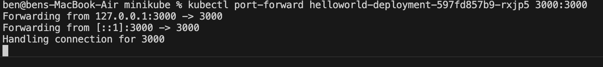
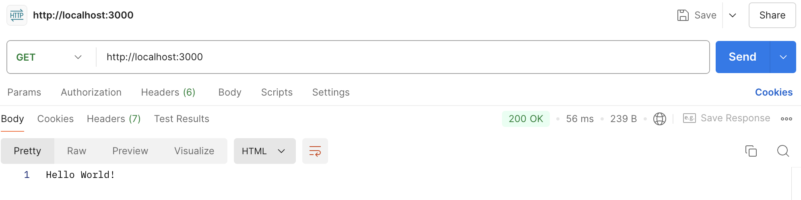

### push image to my dockerhub using "latest" default tag
```
cd node
docker build -t dckerbeniii/helloworld-image .
docker login
docker push dckerbeniii/helloworld-image

```
### minikube deployment using kubectl and docker as a minikube driver
```
cd minikube
minikube start --driver=docker
kubectl apply -f helloworld-deployment.yaml
kubectl get all
```

#### forward
```
kubectl get pods
kubectl port-forward <helloworld-pod-name> 3000:3000
```



#### postman
